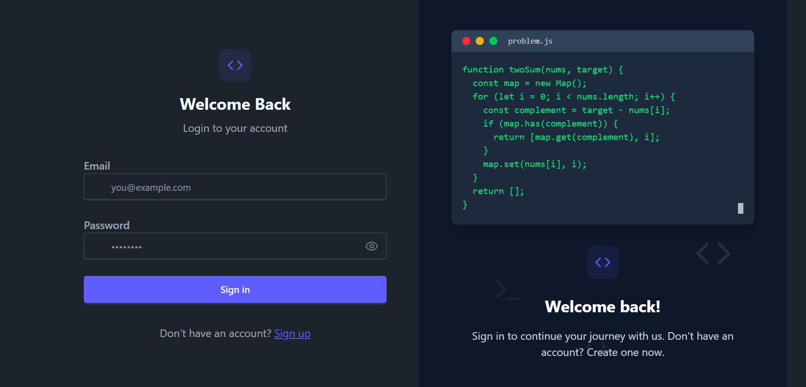
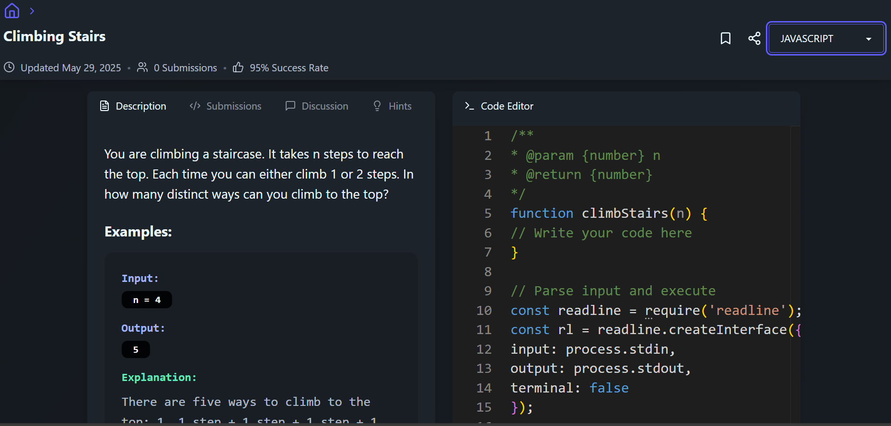
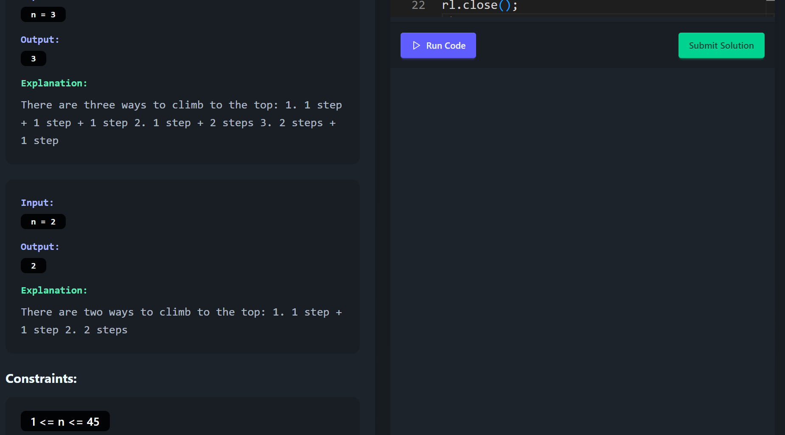
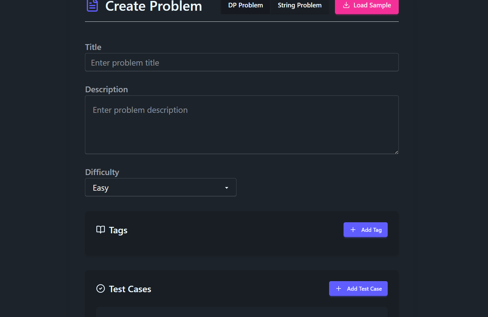
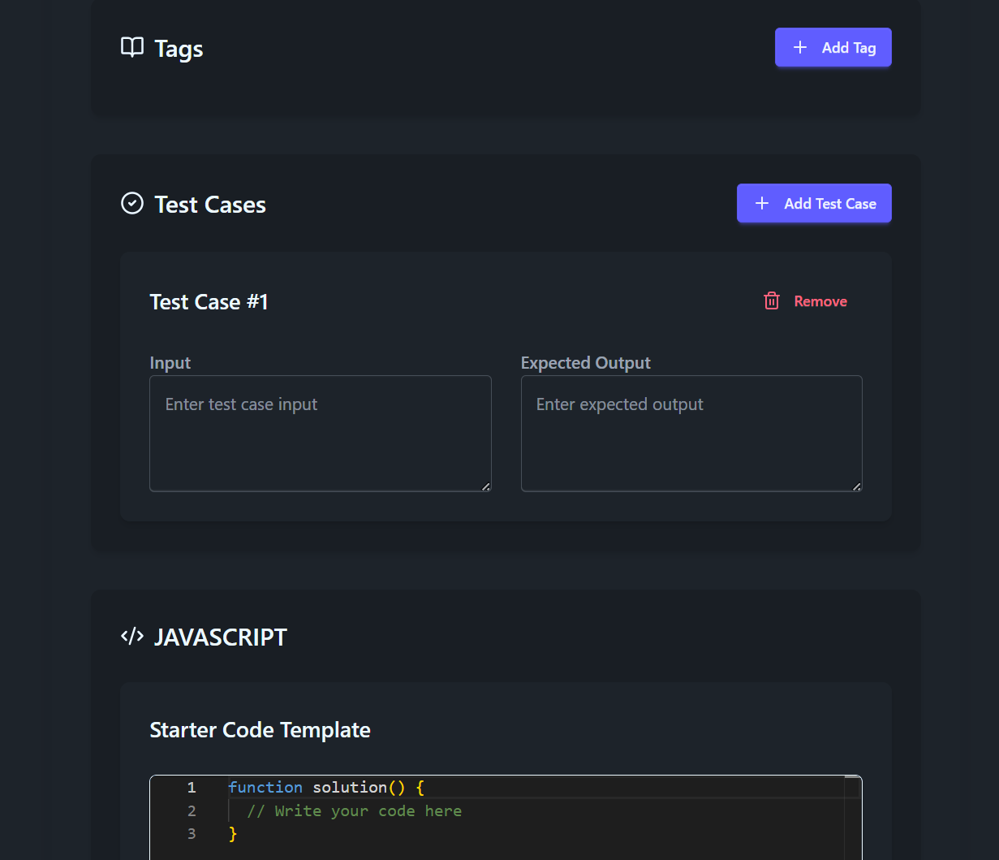
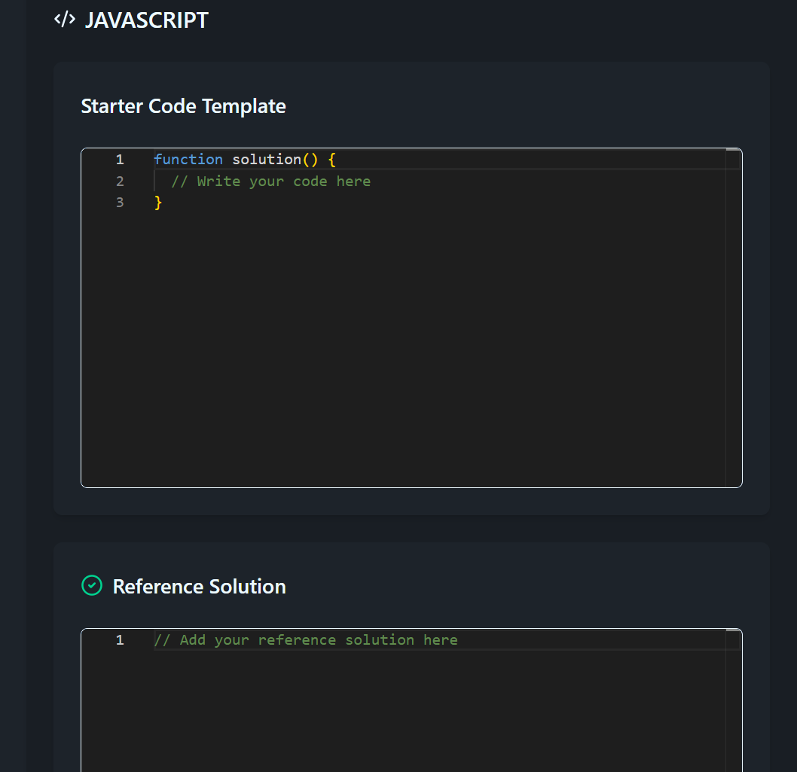

# ⚡ Codestrix

Codestrix is a full-stack coding platform designed to offer an immersive, in-browser problem-solving experience with support for multi-language code execution. It features secure authentication, dynamic challenge workflows, playlists, and a clean, responsive UI.


---

## 🚀 Features

- 🔐 **Secure Authentication**: User login and signup using bcrypt and JWT.
- 🧠 **Problem Management**: APIs for problem creation, editing, and solving.
- 📦 **Code Execution Engine**: Integrated with a self-hosted [Judge0 CE](https://github.com/judge0/judge0) via Docker for multi-language support.
- 📝 **In-Browser Editor**: Powered by Monaco Editor (used in VS Code).
- 🧪 **Type-safe Validation**: Used Zod for runtime form validation and error safety.
- 🎧 **Global State Management**: Managed using Zustand for performance and simplicity.
- 📚 **Playlists**: Create and organize problems into playlists.
- 🌐 **Responsive UI**: Built with React, TailwindCSS, DaisyUI, and React Router.
- 🔥 **Smooth UX**: Feedback powered by React Hot Toast.

---

## 🖼️ Screenshots




### 🧠 Problem View




### 📋 Problem Creation




---

## 🛠 Tech Stack

### Frontend
- React.js
- TailwindCSS + DaisyUI
- Zustand
- React Router
- Zod
- Monaco Editor
- React Hot Toast

### Backend
- Node.js + Express.js
- MongoDB
- JWT + bcrypt
- Judge0 CE (via Docker)

---

## 🧪 Local Setup

### 📦 Prerequisites
- Node.js + npm
- Docker (for Judge0 CE)
- MongoDB (local or remote)

---

### 🚧 Backend Setup

```bash
# Clone repository
git clone https://github.com/Siddharth20mishra/Codestrix.git
cd Codestrix/backend

# Install dependencies
npm install

# Run server
npm run dev

### 🚧 Frontend Setup

```bash
# Clone repository
git clone https://github.com/Siddharth20mishra/Codestrix.git
cd Codestrix/frontend

# Install dependencies
npm install

# Run server
npm run dev
